<p align="center">
  <a href="https://github.com/Debajyoti02-mac">
    
  </a>
</p>

<p align="center">
  
  
</p>

---

## `~/about.py`

```python
class Debajyoti:
    role      = "BCA student → AI/ML engineer"
    focus     = ["Agentic AI systems", "Data Structures & Algorithms"]
    building  = "Research-Agent"
    learning  = ["RAG", "Tool Calling", "Multi-Agent", "LangGraph"]
    philosophy = "Build it manually first, abstract it later."

    def next_step(self):
        return "Ship something that reasons, retrieves, and remembers."
```

---

## 🧭 The Roadmap

```mermaid
flowchart LR
    A([Naive RAG]) --> B([ChromaDB])
    B --> C([Tool Calling])
    C --> D([ReAct Agent])
    D --> E([Memory])
    E --> F([Multi-Agent])
    F --> G([LangGraph])
    G --> H([LangSmith])
    H --> I([Deploy 🚀])

    style A fill:#161b22,stroke:#58a6ff,color:#fff
    style B fill:#161b22,stroke:#58a6ff,color:#fff
    style C fill:#161b22,stroke:#58a6ff,color:#fff
    style D fill:#161b22,stroke:#58a6ff,color:#fff
    style E fill:#161b22,stroke:#58a6ff,color:#fff
    style F fill:#161b22,stroke:#58a6ff,color:#fff
    style G fill:#161b22,stroke:#58a6ff,color:#fff
    style H fill:#161b22,stroke:#58a6ff,color:#fff
    style I fill:#1f6feb,stroke:#58a6ff,color:#fff
```



---

## 🔬 Currently in the Lab

| Project | What it is | Stack |
|---|---|---|
| [**Research-Agent**](https://github.com/Debajyoti02-mac/Research-Agent-) | An agent that plans, retrieves, and synthesizes research | Python · LangChain · ChromaDB |

---

## 🧰 Toolbox

<p>
  
</p>


---

## 📈 Activity

<p align="center">
  
  
</p>

<p align="center">
  
</p>

---

## 🤝 Connect

<p align="center">
  <a href="mailto:debuhazra96@gmail.com"></a>
  <a href="https://linkedin.com/in/YOUR-USERNAME"></a>
  <a href="https://twitter.com/YOUR-USERNAME"></a>
</p>


